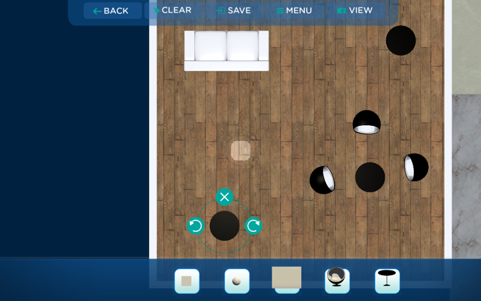

Having done lots of architectural VR projects at [Nerdiacs](http://www.nerdiacs.com/) using [Unity](http://unity3d.com/) in the past, one thing that I hated in the workflow was the interior design pass. After making even the tiniest of change, we would need to re-bake the entire scene and produce a new VR build (for Android) to walk through the scene. As we were already working on an in-house tool that allows us to decorate a scene on a tablet and view the changes live in VR on another computer, I decided to extend the tool to support re-baking direct from the tablet.

To make this work, the idea was that in the tablet application the user can place the furniture as they wish and when they press Save the scene is serialized from the tablet sent to Unity somehow for baking which then produces an asset bundle which is sent via network to a computer on which the end user is viewing the VR scene. This workflow allows us to have a non technical user use the tablet app to place items and auto deploy to a live VR scene.

Doing this in Unity turned out to be far less complex than I expected it to be. Firstly, we serialize the scene in a format that we can load in the editor. Luckily, as we already have the tablet tool completed and had a JSON format that the app+Unity can read. When we press ‘Save’ in the app, the app sends the JSON to the VR scene which in turn saves the file on a network computer which is going to do the actual baking and runs a batch script on that computer.

> D:\\Unity5\\Editor\\unity.exe -batchmode -projectPath <Project Path> -executeMethod NetworkBuilder.BuildAssets -quit %\*

Thats all that there is to it in the batch script. Lets break it down step by step.

**batchmode:** This means that we don’t want unity to run the GUI and make sure that Unity does not need any human intervention.

**projectPath:** The project to load in Unity

**executeMethod:** This allows us to run a function in an Editor script as soon as the project is loaded! We call the function in <ClassName>.<FunctionName> order. NetworkBuilder was the class I was using and BuildAssets was the function.

**quit:** Quit as soon as the function returns.

**%\*:** These characters allow us to pass whatever arguments the batch script was called with to be forwarded to Unity

With a single batch command we have Unity loaded with our project and an entry point into an editor script. Now in BuildAssets the first thing we do, is get the command line arguments:

> string\[\] args = Environment.GetCommandLineArgs();

I used the command line arguments only during debugging to alternate between different asset bundles but it opens up the possibility to do a lot of stuff with Unity.

Now the first thing we need to do to bake is to load the scene with the model of the architecture that we are decorating. We had a single scene setup with lighting that was loaded using **EditorApplication.OpenScene** to open the scene in Unity. After this we parse the JSON file with the scene data, load all needed prefabs and place them in the scene just like we have them placed in the tablet.

Once we have the scene ready for baking, we call **BuildPipeline.BuildAssetBundles** to produce an asset bundle out of Unity that can be loaded in the live VR app. This spits out a shiny new asset bundle, ready to be loaded in the live VR project.

To make it even more interesting and modular, we had a different project used for baking the light-maps and a different project used to make the VR scene that was running live.

The final crucial component to making this work, is that just before loading the new scene you have to call

> **Caching.CleanCache();**

This allows us to clear all light map cache that might linger when loading the new scene and have the correct new light maps loaded from the asset bundle.

Thanks to this technique we have a single point of control for building light maps and 2 non-technical applications which the end users can use to build and experience the VR scenes while we keep tinkering with the light map settings to get the perfect quality/time ratio.
