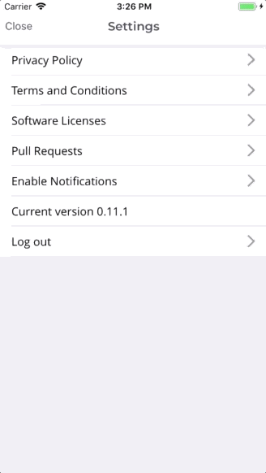
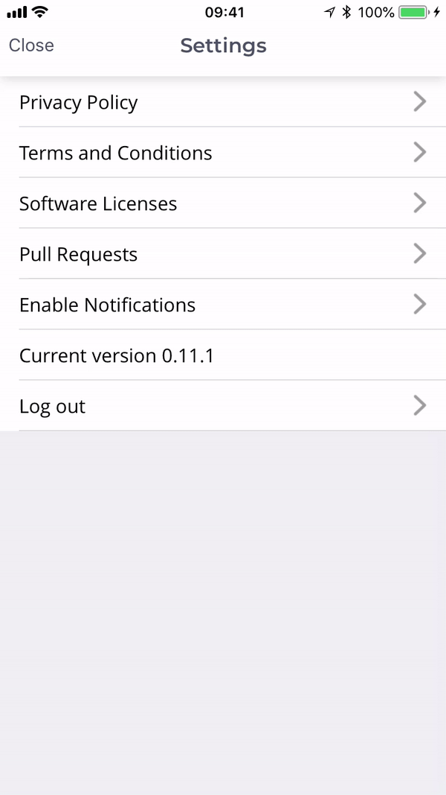

Early last year, we at [Sense Health](https://www.sense-health.com/) decided to move all future mobile development to [React Native](https://facebook.github.io/react-native/). With a clear ambition to improve speed of development and iteration time, we saw that our team of skilled native developers coupled with a few solid front-end developers could speed up the development cycle by optimizing our workflow specifically for React Native development.

One of my favorite features of React Native is that almost the entire application logic lies in a JavaScript bundle. This means that all of the core code is interpreted on the fly and can be replaced over the air. During development this means extremely fast iterations; saving a file and reloading the app instantly uses the updated code. This allows rapid trial and error during development and removes the compile and wait time that native code comes introduce (Android has improved this with [Instant Run](https://developer.android.com/studio/run/#instant-run) but there is still a long way to go to match the speed of RN development)

](./asset-1.gif)

The idea that the application logic is just a JavaScript bundle opens up a lot of new possibilities. One of the best utilization of this feature for deployments is [CodePush](https://github.com/Microsoft/react-native-code-push). CodePush allows you to deploy code updates and some assets over the air just like a website. This means no more waiting for app store reviews, just deploy the app through CodePush and when the user opens the app the JS bundle is updated in the background and the next time they open the app that annoying bug they were facing is fixed as long as the native code is not changed (Which is mostly the case for us)

With such amazing tooling in place, we never resisted the changes introduced by React Native and have went ahead to change our team structure and deployment processes to improve the development cycle as effectively as possible for our new application [NiceDay](https://niceday.app/).

Over the last year some amazing engineers at Sense Health have built an extremely efficient way of working on top of our existing CI, communication and project management tools. In our current workflow we build and deploy releases in [Travis](https://travis-ci.org/) using [fastlane](https://fastlane.tools/) and automatically deploy for different platforms (iOS/Android/CodePush) and stages (Alpha/Beta/Production). With automated scripts taking over the build steps, we have extended our CI workflow to announce releases on Slack for QA to start testing and showing the deployment status of each PR/Issue on Github to know whether its available in Alpha/Beta or Production. This also automatically moves all issues into \`Deployed to Alpha/Beta/Production\` lanes in our project management tool [Waffle](https://waffle.io/), giving a complete automated overview of every issue that is currently deployed!

](./asset-2.jpeg)

Being a small team we have to be highly critical of the amount of time we spend and where we spend it and hence have been refining our process multiple times over the last year and are always looking at ways to make it even better.

Last week while having a brainstorming session with a colleague ([Ruben Weijers,](https://twitter.com/freakinruben) who built the whole fastlane deployment pipeline!) to reduce time spent on code reviews, he shared how the team at [Artsy were testing Pull Requests](https://artsy.github.io/blog/2018/03/17/two-years-of-react-native/#video) in their production application by adding a hidden Admin page. The idea is that if we can deploy code over the air for Alpha/Beta/Production, then we can do the same for Pull Requests and allow the user to select the PR in a hidden page to replace the current app bundle with the code in the latest commit for the PR.

That means every time there is a new commit for a PR, its built and deployed to CodePush and you can select the PR in the existing application to test the new commit and actually see how it looks!

I think this is a brilliant way to test PRs as this would save hours of developer time by allowing them to test PRs without building for iOS and Android each time they review code. Secondly, it can change the way PRs are tested completely specially for visual changes as now even the product owner and the designers can test the latest commit of each PR!

Building this is quite easy as CodePush supports a concept called [Dynamic Deployment Assignment.](https://github.com/Microsoft/react-native-code-push#dynamic-deployment-assignment) The idea is that when an app starts it checks for updates via CodePush in its current deployment (i.e Alpha/Beta or Production) but we can make as many deployments as we want and can switch deployments at run-time. This means that production users can become beta testers on the fly.

When a user opts-in to become a beta tester, we ask CodePush to update the JS version of the app to the beta deployment which then overrides the current production JS code with the beta code and voila, we now have the latest beta features ready to test!

The same concept can be applied for PRs. If each PR is a different deployment we can just switch from the Alpha version of the app to any PR deployment and we would have the latest code for this PR.

To make this functional we only need to build 2 things:

1) We need to build the JS code and deploy it each time there is a commit to a PR, create a deployment stage in CodePush and then store the information somewhere

2) Add a debug menu to only the Alpha version of the app (for security reasons lets not allow this in any other version) and list all built PRs

Already having Travis and fastlane in place, I decided to just add a lane in fastlane to build the PR and create a new deployment key for new PRs. This information is then stored in Amazon S3. To run this lane, I added a new [build stage](https://docs.travis-ci.com/user/build-stages/) in Travis to our existing configuration to run for all new PRs and commits to PRs.

Next in the application we would just retrieve all the data from S3 and display it in a list. When a user selects a PR, we then ask CodePush to switch the current deployment. This would then replace the app code from Alpha to the latest code in the specified PR deployment and voila you are ready to test.

As each PR is a deployment, similar to Alpha/Beta/Production, any time there is a new update the application is automatically updated. Which means whenever there is a new commit, the application updates itself in the background to the code from the latest commit!

---

It took less than 2 days of effort for prototyping, polishing and integrating the feature into our app and I can see this saving hours of work for each developer reviewing the PR as now they don’t need to manually build for iOS and Android to test PRs before accepting them and can just test it in the alpha version of the app on their phones.

Having just deployed this feature this week, I am curious to see how this feature is used by the team in the coming weeks and what new ideas come from the team to build an even more effective workflow.
